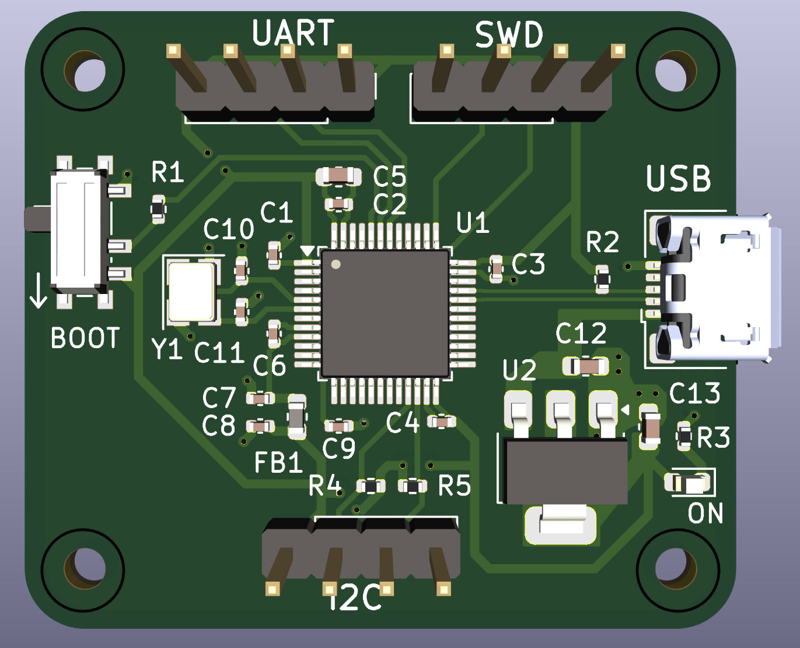

# STM32 PCB Design Project

## Overview

This repository contains the design files for a custom PCB based on the STM32 microcontroller.
The PCB is designed for prototyping and development, exposing key interfaces including UART, I2C, and SWD.

## Features

STM32 Microcontroller (STM32F103C8T6): Central processing unit for the board.

Exposed Interfaces:

UART: For serial communication.

I2C: For connecting peripherals like sensors or displays.

SWD: For debugging and programming.

USB: For data transfer and power.

## Project Structure

`/production`: Fabrication toolkit output. Contains the gerber (stm32_basic.zip), bom, and position files for manufacturing.

`/stm32_basic.kicad_pro`: Project file that defines the KiCad project.

`/stm32_basic.kicad_sch`: Circuit schematic.

`/stm32_basic.kicad_pcb`: Circuit layout.

`/parts`: Includes 3D models for pcb parts.

`/docs`: Images.

TO-D0

`/firmware`: Sample firmware for testing the exposed interfaces.

## PCB

